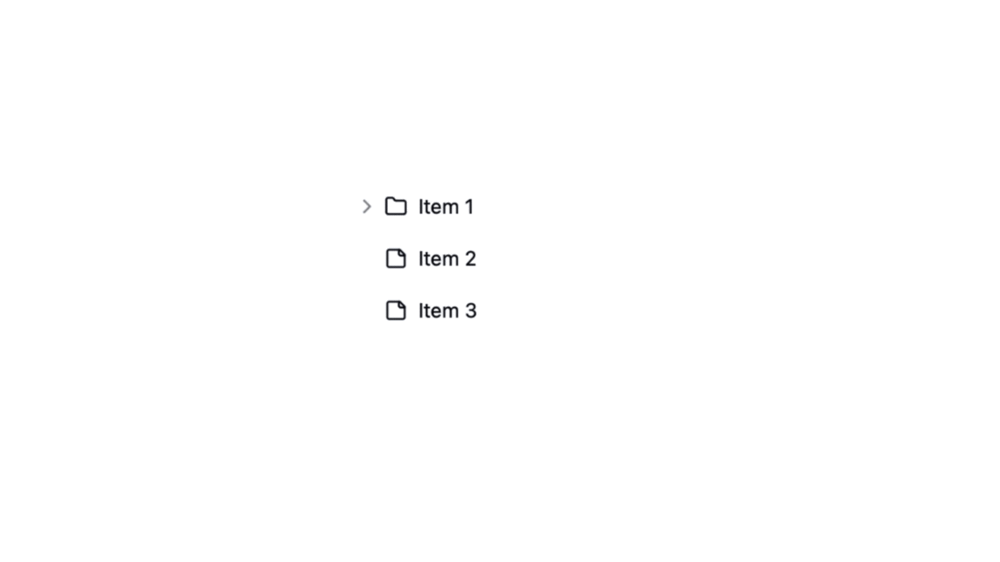

# Tree View - [Shadcn UI](https://ui.shadcn.com/)
The Tree View component allows you to navigate hierarchical lists of data with nested levels that can be expanded and collapsed.

Based on [implementation](https://github.com/shadcn-ui/ui/issues/355#issuecomment-1703767574) by [WangLarry](https://github.com/WangLarry) and [bytechase](https://github.com/bytechase).



### [DEMO](https://mrlightful.com/ui/tree-view)
[Tree View Table (advanced)](https://github.com/PatrickSCLin/shadcn-tree-table)

## Features
- [x] Expand, collapse, and select items.
- [x] Custom icons per item (default, open, selected).
- [x] Default node & leaf icons per tree view.
- [x] Action buttons (e.g. a button to add a new item).
- [x] Click handlers per tree item and per the entire tree view.
- [x] Drag & drop support.
- [x] Disabled state.
- [x] Custom item renderers. 

## Installation

```sh
npx shadcn add "https://mrlightful.com/registry/tree-view"
```

## Usage

### Props
#### Tree View
```tsx
type TreeProps = React.HTMLAttributes<HTMLDivElement> & {
    data: TreeDataItem[] | TreeDataItem
    initialSelectedItemId?: string
    onSelectChange?: (item: TreeDataItem | undefined) => void
    renderItem?: (params: TreeRenderItemParams) => React.ReactNode
    expandAll?: boolean
    defaultNodeIcon?: React.ComponentType<{ className?: string }>
    defaultLeafIcon?: React.ComponentType<{ className?: string }>
}
```

#### Tree Item
```tsx
interface TreeDataItem {
    id: string
    name: string
    icon?: React.ComponentType<{ className?: string }>
    selectedIcon?: React.ComponentType<{ className?: string }>
    openIcon?: React.ComponentType<{ className?: string }>
    children?: TreeDataItem[]
    actions?: React.ReactNode
    onClick?: () => void
    draggable?: boolean
    droppable?: boolean
    disabled?: boolean
    className?: string
}
```

### Basic
```tsx
import { TreeView, TreeDataItem } from '@/components/ui/tree-view';

const data: TreeDataItem[] = [
  {
    id: '1',
    name: 'Item 1',
    children: [
      {
        id: '2',
        name: 'Item 1.1',
        children: [
          {
            id: '3',
            name: 'Item 1.1.1',
          },
          {
            id: '4',
            name: 'Item 1.1.2',
          },
        ],
      },
      {
        id: '5',
        name: 'Item 1.2 (disabled)',
        disabled: true
      },
    ],
  },
  {
    id: '6',
    name: 'Item 2 (draggable)',
    draggable: true
  },
];

<TreeView data={data} />;
```

## Roadmap
- [ ] Add support for programmatically controlling items (https://github.com/romatallinn/shadcn-tree-view/issues/2).

## Alternatives

- [Kibo UI / Tree](https://www.kibo-ui.com/components/tree)
- [ReUI / Tree](https://reui.io/docs/tree)

# License
Licensed under the MIT license, see [`LICENSE`](LICENSE).
